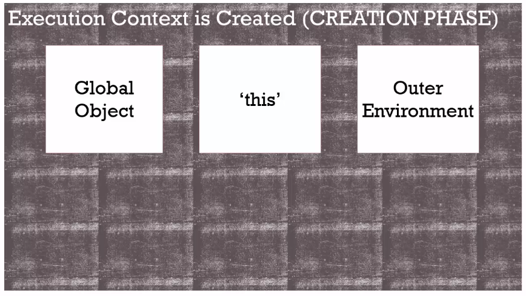
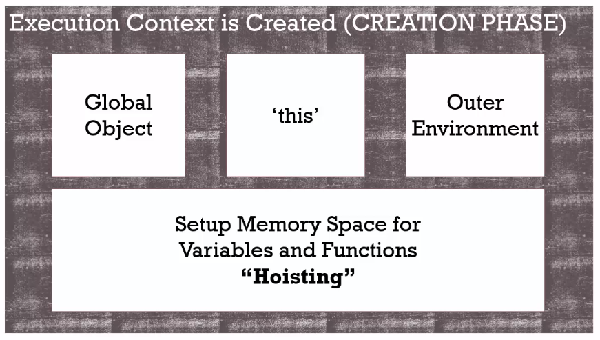

# The Execution Context: Creation and 'Hoisting'

### So we learned that the JS engine is wrapping the execution code in execution context. We will go over **_HOW_** exactly the JS engine creates the execution context; by understanding what is `Creation` and `Hoisting`.

### Guess what this will print:

```javascript
var a = 'Hello';

function b() {
    console.log('Hello World!');
}

b();
console.log(a);

//Hello World!
//Hello
```

Here is a visual explanation: [via PythonTutor.com - If link doesn't work, copy and paste it on the browser. And make sure it's not _https://_, just _http://_](http://pythontutor.com/javascript.html#code=var%20a%20%3D%20%22Hello%22%3B%0A%0Afunction%20b%28%29%7B%0A%20%20%0A%20console.log%28%22Hello%20World!%22%29%3B%20%0A%7D%0A%0Ab%28%29%3B%0Aconsole.log%28a%29%3B&curInstr=0&mode=display&origin=opt-frontend.js&py=js&rawInputLstJSON=%5B%5D)

### Try this now:

```javascript
b();
console.log(a);

var a = 'Hello';

function b() {
    console.log('Hello World!');
}

b();
console.log(a);

//Hello World!
//undefined
```

## Why does it return `undefined`?

-   TA: demo without `var a = 'Hello';`

```javascript
//Uncaught Reference Error: a is not defined
```

huh.

## This phenomenon is called `Hoisting`

### If you were to search up `Hoisting`, most sites explain it as variables and functions in JS are moved to the top by the JS engine so that they work no matter where you put them.

### But we can see that's not the case because removed `var a`, it was returned `undefined`.

## What we saw when `var a` was removed is equivocal to this:

```javascript
function b() {
    console.log('Hello World!');
}

var a;

b();
console.log(a);

a = 'Hello';
```

### It was more like if it declared the variable and then set the value later.

## But... that's not really what's happening. What's being executed isn't what you've written, it's being translated by the JS engine. So it's not like the JS engine is physically moving the code that you've typed around and then executed it.

# Let's talk about `Creation`

### The reason JS behaves the way it does, the variables and functions are to some degree available even though they're written later in the code, is because the execution context is created in `two phases`.

## The first phase is called `creation phase`.



### In that phase, we know that there is a `Global Object`, and `'this'` is created in memory, there is also an `Outer Environment` that's created. In Creation Phase, the parser runs through your code and begins to set up what you've written for translation.

### It recognizes where you've created variables and where you've created functions.

## So it sets up the memory space for the variables and functions. That is what confusingly called `Hoisting`.



### All it means is that before _your_ code beings to be executed line by line, the JS engine has already set aside memory space for the variables that you've created in that entire code and all of the functions as well.

### So when the code begins to execute line by line, it can access them.

## However, when it comes to variables, it's a little bit different.

### When it comes to functions, it's entirety is saved into memory space; the name and all of the code inside.

# The assignment of values comes in the next phase, the `Execution Phase`.

### So when JS engine sets up the memory space, it doesn't know what the value will be until it starts executing it's code. So it puts a placeholder called `undefined`.

## All variables in JS are initially set to `undefined`!

### Which is why it's a good practice to avoid situations where you'd have to rely on Hoisting.
