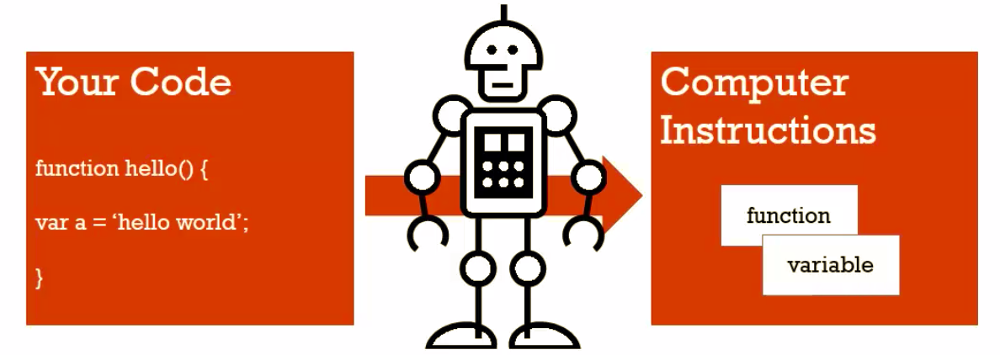

# Conceptual Aside: Syntax Parsers, Execution Context, and Lexical Environments

JavaScript is NOT magic. Someone or other people built programs that convert your JavaScript into something the computer can understand. Those programs are called `Compilers`. The `Compilers` do the process, the work of actually reading your code, character by character. And determines if the syntax is valid and then implement that syntax in a way computers can understand.

#### The code you write gets converted to a real set of computer instructions, something the hardware can physically understand.

## **Syntax Parsers**: A program that reads your code and determines what it does and if its grammar is valid.

So it's going through character by character like F-U-N-C-T-I-O-N. and It'll say "Oh, that's a function so there should be a space after this." and then the next thing it see up until the paranthesis will be the name of the function, etc. And that gets translated by the systems/programs that someone else wrote. And along the way, the `engine` that is interpreting your code can decide to do other things.

## **Lexical Environments**: Where something sits physically in the code you write.

`Lexical` means `having to do with words or grammar`. A lexical environment exists in programming languages in which **where** you write something is _important_.

#### Not all programming languages are that way.

Let's say there's a function with a variable inside of it. The variable sits lexically inside the function, that is physically the code you're writing, that's where it sits.

In programming languages where the lexical environment is important, that means that where you see things written gives you an idea of where it will actually sit in the computer's memory. And how it'll interact with other variables and functions and elements of the program. The compiler that's converting your code to instructions computers can understand actually cares about where you put things. Syntax Parser loves it helps it make decisions.

#### Basically, Lexical Environment of something in the code means where it's written and what surrounds it.

## **Execution Context**: A wrapper to help manage the code that is running.

There are lots of lexical environments. Which one is currently running is managed via execution context. It can contain things beyond what you've written in your code.
